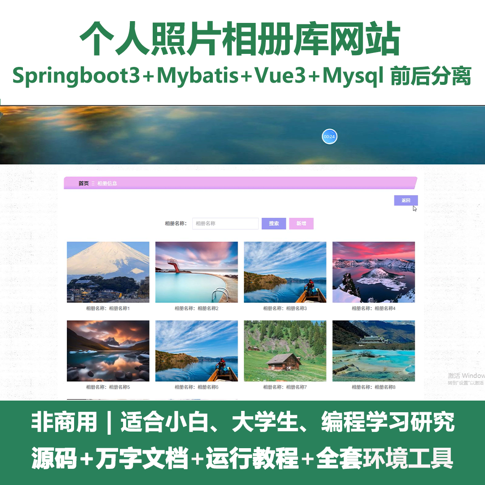
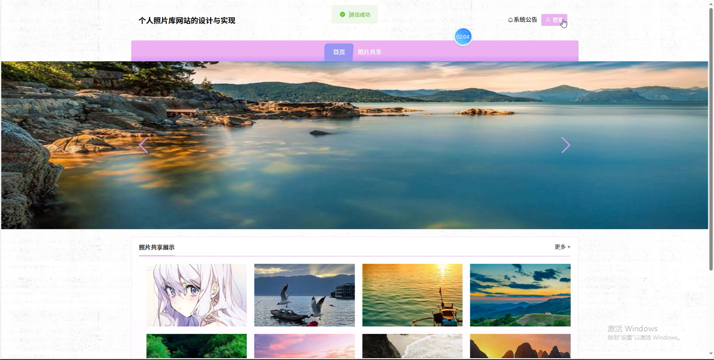
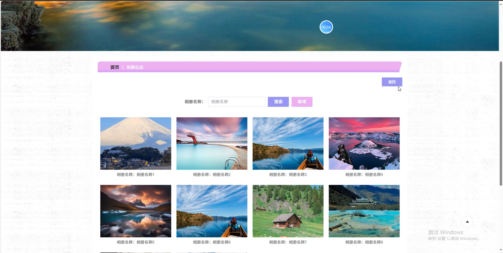
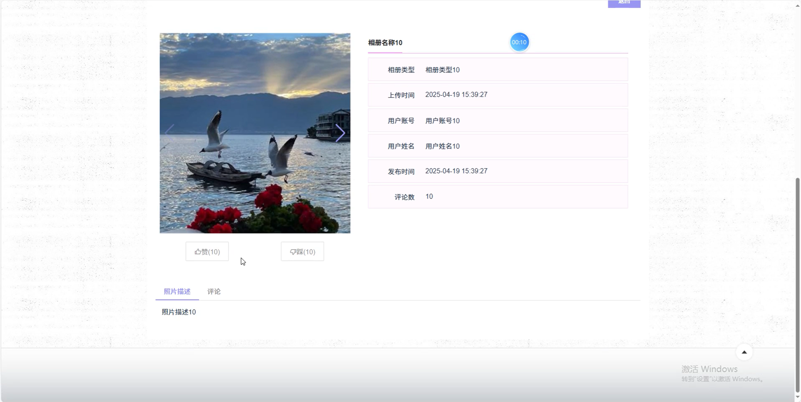
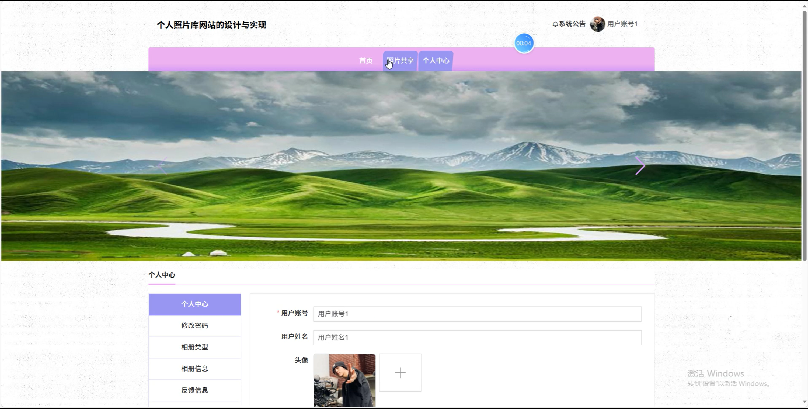
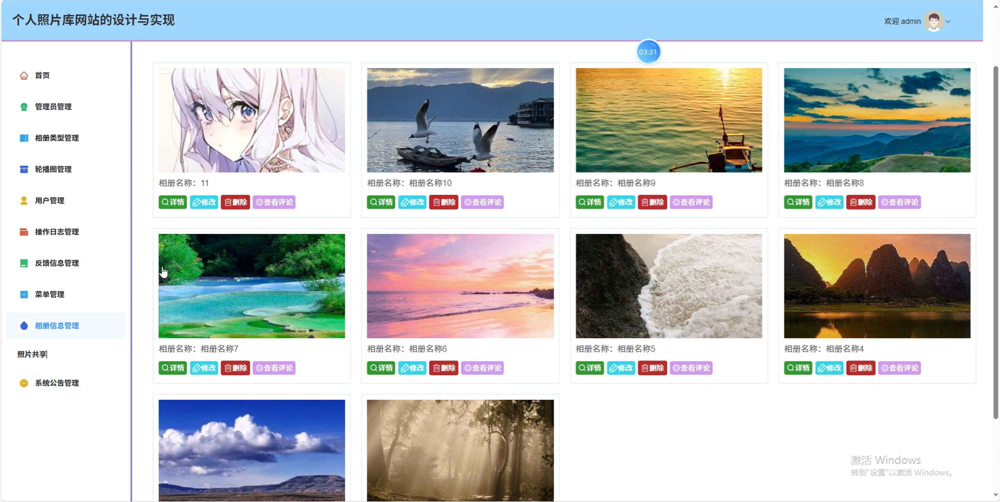
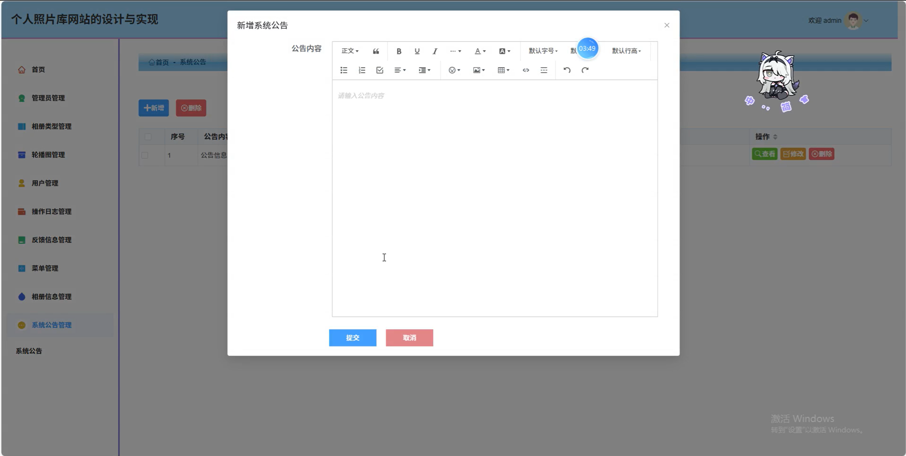
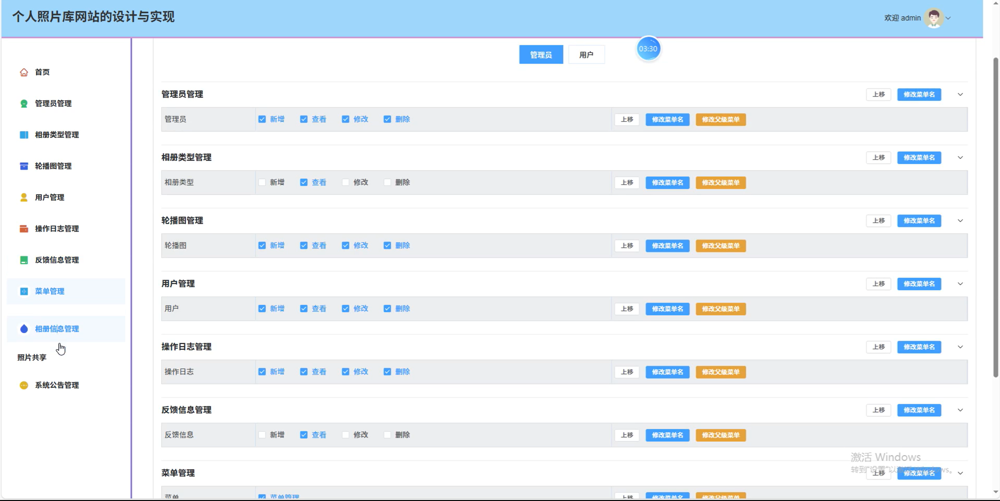
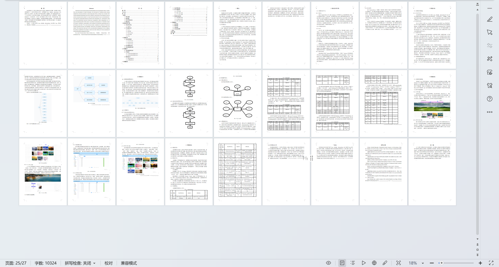

# springbootA433D
springbootA433D个人照片相册库网站+LW
 
## 查看主页获取源码

### 一、关键词
相册类型管理、相册信息管理、照片共享

### 二、作品包含
源码+数据库+设计文档万字+全套环境和工具资源+本地部署教程

### 三、项目技术
前端技术：Html、Css、Js、Vue3.0、Element-plus 
后端技术：Java、SpringBoot3.0、MyBatis

### 四、运行环境（以下版本亲测，其他版本未知，请自测）
开发工具：IDEA/eclipse  + VSCODE

数据库：MySQL5.7（最低要5.7版本）

数据库管理工具：Navicat10以上版本

环境配置软件： JDK17 + Maven3.6.3

前端Nodejs：20

浏览器：谷歌浏览器

### 五、项目介绍
项目编号：springbootA433D

个人照片相册库网站主要用于个人便捷存储照片，并可实现照片共享与个人回忆整理。

角色：管理员、用户

用户功能：首页、照片共享、个人中心、修改密码、相册类型、相册信息、反馈信息。

管理员功能：首页、管理员管理、相册类型管理、轮播图管理、用户管理、操作日志管理、反馈信息管理、菜单管理、相册信息管理、系统公告管理。

### 六、运行截图

